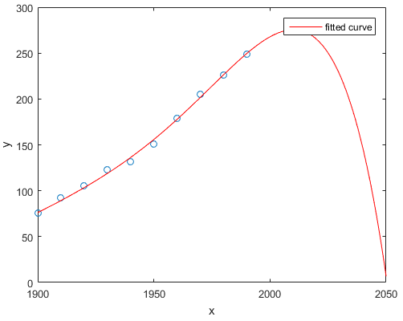

Answers to MITx 6.00.2x Final Exam
==========

Problem 1-1
----------

> Consider deriving the probability of a coin flip coming up heads by running $m$ trials of 100 flips each. If the coin is fair, the mean probability of the $m$ trials will go to 0.5 as m goes to infinity.
>
>- **True**
>- False

According to the *Law of Large Numbers*, as the number of trials $m$ increases the average of mean probabilities will tend to the true probability, which for a fair coin is 0.5.

Problem 1-2
----------

> Consider two normal distributions, A and B. The standard deviation of A is 3 and the standard deviation of B is 5. For each distribution, 1,000 observations are drawn and plotted in a histogram with 10 bins, creating one histogram for each distribution.
>
>- The rightmost bin of A will have fewer points than the rightmost bin of B.
>- The rightmost bin of B will have fewer points than the rightmost bin of A.
>- The rightmost bin of A will have the same number of points as the rightmost bin of B.
>- **Any of the above are possible.**

The rightmost bins of both A and B should account for a small amount of data points. Even though A has a smaller standard deviation, it is fairly possible that A will have an equal or more points in the rightmost bin than A, for a sample of any size. Also, it is not clear if the same bin width was used for both histograms.

Problem 1-3
----------

> You roll an unfair (weighted) die. The distribution of the numbers rolled is a uniform distribution.
>
>- True
>- **False**

By definition, and unfair die should have a higher roll chance on one or more faces. A uniform distribution does not represent the roll of an unfair die.

Problem 1-4
----------

> A simulation
>
> - is useful when describing a system that cannot easily be described mathematically.
> - is easy to successively refine.
> - can be used to extract intermediate results.
> - **All of the above**
> - None of the above

All of the above are true. It can be used to describe complex systems such as molecular interactions in gases, traffic in a city, stock fluctuations. It's easy to refine because the simulation can be rerun at minimal cost, compared to say a survey. Finally, it can be used to extract results prior to a costly experiment.

Problem 1-5
----------

> The following image plots the population of the US over time, along with a model fit to the data. This is an example of
>
>
>
>- **overfitting**
>- underfitting
>- Neither of the above

The proposed model predicts that by 2050 the population of the US will become extinct, even when the data shows that it has been increasing every year. This is an example of overfitting by using a high polynomial order.

Problem 1-6
----------

> If the $R^2$ of a model produced using linear regression is 0.7, the model accounts for 70% of the variance in the observations.
>
> - **True**
> - False

Problem 1-7
----------

> Given a finite set of data points there exists a polynomial fit such that the polynomial curve goes through each point in the data.
>
> - **True**
> - False

Given that no two data points share the same $x$ value, there always exist a polynomial of degree $N$ that goes through each point, where $N$ is the nuumber of data points. This is because the Vandermonde matrix determinant is always non-zero.

Problem 1-8
----------

> You want to calculate confidence intervals by applying the empirical rule, which requires that you have a normal distribution with a known mean and standard deviation. Which approach can you use to estimate the mean and standard deviation that you need? Choose all that work.
>
> - **Central Limit Theorem, which requires that you have many sufficiently large samples from the population**
> - **Standard Error, which requires that you have one sufficiently large sample**

Both approaches will work, provided that the sample sizes are sufficiently large.

